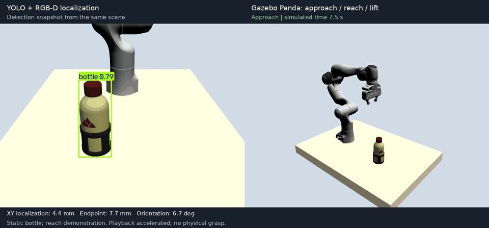
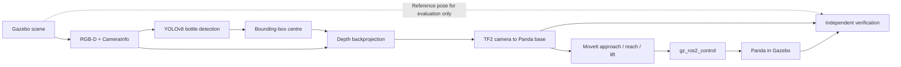

# Vision-Guided Robot Manipulation

A ROS 2 Jazzy project connecting object detection, camera geometry, TF2 and
MoveIt 2 to a simulated Franka Panda.



Three tested bottle positions passed independent localization and endpoint
checks. [Recorded measurements](docs/validation.md) and
[the Chinese operating guide](docs/gazebo-guide.zh-TW.md) accompany the demo.

## Pipeline

Gazebo RGB-D camera → YOLO → depth backprojection → TF2 → MoveIt 2 → Panda approach/reach/lift

The original saved-image prototype is preserved in `vision_pipeline/`. The
Gazebo version puts the robot, table, bottle and camera in the same scene.



## Scope

- YOLO processes an image rendered by the Gazebo RGB-D camera.
- Camera intrinsics and aligned depth replace the prototype's illustrative values.
- TF2 transforms the measured position into `panda_link0`.
- A cylindrical radius prior estimates the bottle axis from the visible surface.
- MoveIt plans three sequential hand poses through Gazebo controllers.
- Independent diagnostics compare localization and the executed endpoint with references.

This is a **reach-motion demonstration**. The bottle is static; no physical
grasp, attachment or place motion is implemented. The three motions are separate
pose plans rather than guaranteed straight Cartesian segments.

## Environment and build

Ubuntu 24.04, ROS 2 Jazzy, Gazebo Harmonic, MoveIt 2, CPU PyTorch and YOLOv8n.
The VirtualBox configuration uses software rendering with Ogre; keep the Ubuntu
desktop session logged in even when running without the Gazebo window.

```bash
sudo apt install ros-jazzy-ros-gz ros-jazzy-gz-ros2-control \
  ros-jazzy-moveit ros-jazzy-moveit-resources-panda-moveit-config \
  ros-jazzy-ros2-control ros-jazzy-ros2-controllers python3-venv python3-pytest \
  python3-psutil python3-opencv python3-numpy python3-yaml

source /opt/ros/jazzy/setup.bash
cd ~/vision_guided_ws
colcon build --symlink-install --packages-select robot_manipulation vision_guided_simulation
source install/setup.bash
```

Use a consistent set of ROS packages: installing a new Gazebo control plugin
alongside older hardware-interface binaries can cause symbol-loading errors.

The vision scripts use the existing `~/vision_guided_ws/.venv-vision` environment.
The default model path is `~/vision_guided_ws/work/vision_smoke_test/yolov8n.pt`.
For a new environment, install CPU PyTorch first to avoid unnecessary CUDA
dependencies, then install the vision requirements:

```bash
python3 -m venv ~/vision_guided_ws/.venv-vision
source ~/vision_guided_ws/.venv-vision/bin/activate
python -m pip install torch torchvision --index-url https://download.pytorch.org/whl/cpu
python -m pip install -r requirements-vision.txt
mkdir -p ~/vision_guided_ws/work/vision_smoke_test
cd ~/vision_guided_ws/work/vision_smoke_test
env -u PYTHONPATH python -c "from ultralytics import YOLO; YOLO('yolov8n.pt')"
```

See [the operating guide](docs/gazebo-guide.zh-TW.md) and
[validation](docs/validation.md) for explanations and test evidence.

## Run

```bash
cd ~/vision_guided_ws/src/vision_guided_manipulation
bash scripts/start_demo.sh
```

To omit the Gazebo window, add `--gui false`. The vision node waits for active
controllers, collision-scene setup and aligned RGB-D data before requesting
motion. It processes one frame; later frames do not repeatedly trigger the arm.

Outputs under `~/vision_guided_ws/work/gazebo_results/`:

| File | Contents |
|---|---|
| `camera_rgb.jpg` | Rendered camera image |
| `camera_detected.jpg` | YOLO annotations |
| `detection.json` | Pixel, depth, intrinsics and transformed target |
| `verification.json` | Localization XY, final position and orientation errors |
| `frames/` | Actual Gazebo overview frames with motion-state metadata |
| `launch.log`, `vision.log` | Startup, planning and detection logs |

Stop the processes started by the session helper:

```bash
python3 scripts/demo_session.py stop
```

For manual ROS commands, source the workspace and set `ROS_DOMAIN_ID=42`.
Request another detection with:

```bash
ros2 service call /vision/detect std_srvs/srv/Trigger '{}'
```

After the sequence passes verification, export the recorded views:

```bash
source ~/vision_guided_ws/.venv-vision/bin/activate
env -u PYTHONPATH python scripts/export_demo.py
```

The GIF combines a detection snapshot with the recorded simulation; playback is
accelerated and the static-bottle limitation is labelled in the image.

## Repository

```text
robot_manipulation/       Pose controller and fake-pose publisher
vision_pipeline/          Saved-image/fixed-depth prototype
vision_guided_simulation/ Gazebo scene, RGB-D perception and diagnostics
scripts/                 Startup and session management
docs/                    Operating guide and validation
```

Scene settings are in `vision_guided_simulation/config/scene.yaml`. Perception
does not read the reference bottle position: that position is used only by the
scene generator and independent monitor.

## Sources

- [MoveIt resources](https://github.com/moveit/moveit_resources): Panda model and planning configuration.
- [gz_ros2_control](https://github.com/ros-controls/gz_ros2_control): control plugin and documented integration.
- [ROS–Gazebo](https://github.com/gazebosim/ros_gz): spawning and camera/clock bridges.
- [Ultralytics](https://github.com/ultralytics/ultralytics): pretrained YOLO detection.

The [Water Bottle model](https://fuel.gazebosim.org/1.0/iche033/models/Water%20Bottle)
is attributed to iche033 and distributed under CC BY 4.0. It was converted,
scaled and simplified for the VM; see its bundled attribution file. External
dependencies retain their respective licenses. The detector, planner and Panda
model are existing components.
