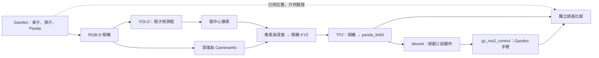

# Gazebo 相機引導 Panda：操作與學習筆記

## 這個版本在做什麼

模擬相機拍攝桌上的瓶子，YOLO 在影像中找出瓶子。程式從框中心讀取深度，用相機內參算出相機座標，再用 TF2 轉成 Panda 底座座標。MoveIt 控制同一個場景中的 Panda，依序接近、下降與抬升。

瓶子目前固定在桌上，不會被拿起來。這是視覺引導的接近動作展示，尚未加入物理抓取與放置。



## 啟動與停止

在 Ubuntu 桌面已登入的情況下執行：

```bash
cd ~/vision_guided_ws/src/vision_guided_manipulation
bash scripts/start_demo.sh
```

VirtualBox 第一次載入模型、相機和控制器可能需要幾分鐘。視覺節點會等待相機資料、控制器啟用和桌子碰撞模型就緒，才要求手臂移動。

只啟動伺服器、不開 Gazebo 視窗：

```bash
bash scripts/start_demo.sh --gui false
```

查看進度：

```bash
tail -f ~/vision_guided_ws/work/gazebo_results/vision.log
```

查看手臂規劃與控制器啟動訊息：

```bash
tail -f ~/vision_guided_ws/work/gazebo_results/launch.log
```

停止這個版本的程序：

```bash
python3 scripts/demo_session.py stop
```

這個模擬使用 `ROS_DOMAIN_ID=42`，與原先的 MoveIt demo 分開。手動檢查 topic 時也要設定相同的值：

```bash
source /opt/ros/jazzy/setup.bash
source ~/vision_guided_ws/install/setup.bash
export ROS_DOMAIN_ID=42
ros2 topic list
ros2 control list_controllers
```

## 再做一次偵測

第一次只處理一張相機影像，避免每個新畫面都觸發手臂動作。完成後可要求再偵測一次：

```bash
ros2 service call /vision/detect std_srvs/srv/Trigger '{}'
```

若找不到瓶子或深度無效，節點會記錄原因，這次不會發布目標。

## 哪些檔案值得先讀

| 檔案 | 回答的問題 |
|---|---|
| `config/scene.yaml` | 桌子、瓶子、相機放在哪裡？ |
| `scene.py` | 如何建立 SDF 場景並把 Panda 接上 Gazebo？ |
| `camera_vision.py` | 如何從相機資料產生機器人目標？ |
| `geometry.py` | 像素與深度如何換成公尺？ |
| `pose_controller.py` | 如何把目標變成三段 MoveIt 動作？ |
| `scene_monitor.py` | 怎麼比較預期位置與實際結果？ |
| `gazebo.launch.py` | 如何把所有節點一起啟動？ |

## 如何判斷正確

`~/vision_guided_ws/work/gazebo_results/` 保存：

- `camera_rgb.jpg`：實際模擬相機畫面。
- `camera_detected.jpg`：YOLO 框出的結果。
- `detection.json`：像素、深度、相機內參和轉換後目標。
- `verification.json`：瓶子軸心 XY 定位誤差、最終手掌位置誤差與姿態誤差。
- `motion_failure.json`：若動作失敗，記錄原因。

判定門檻：瓶子軸心 XY 誤差不超過 5 cm、最終手掌位置誤差不超過 1.5 cm、姿態角度誤差不超過 0.18 rad（約 10.3 度）。這是此展示的門檻，不代表工業抓取精度。

深度量到的是瓶子表面，不是軸心。本版使用約 4.6 cm 半徑的圓柱假設，把可見表面向軸心修正。手掌目標再加上 18 cm 的高度間距，避免把手掌中心直接送進瓶子。這些是物件幾何與末端工具的簡化假設；設定在 `config/vision.yaml`。

三段動作分別規劃到目標上方 10 cm、手掌目標、目標上方 15 cm。它們是三段到達指定姿態的規劃，沒有保證下降或抬升沿直線。

## 已經測到什麼

三個瓶子位置 `(0.45, 0)`、`(0.45, +0.08)`、`(0.45, -0.08)` 都完成動作。水平定位誤差約 4–5 mm，最終手掌位置誤差約 6–8 mm，姿態誤差約 5–7 度。原始數據保存在 `docs/results/`；這些結果適用於目前的瓶子模型與相機場景。

你整合的是相機資料同步、像素與深度定位、座標轉換、動作順序、場景啟動和結果驗證。YOLO 的辨識模型、MoveIt 的 IK 與規劃器，以及 Panda 模型是現成元件。

## 產生展示動圖

完成一次通過驗證的動作後：

```bash
cd ~/vision_guided_ws/src/vision_guided_manipulation
source ~/vision_guided_ws/.venv-vision/bin/activate
env -u PYTHONPATH python scripts/export_demo.py
```

產生的 `~/vision_guided_ws/work/gazebo_results/gazebo-demo.gif` 左邊是該次相機的偵測快照，右邊是 Gazebo 全景相機記錄的動作。播放經過加速；瓶子固定、沒有物理夾取的限制會寫在動圖上。程式會先確認 `verification.json` 通過，才輸出成功展示。

## 常見問題

**相機不出圖：**確認 Ubuntu 桌面仍登入。VM 版本使用 Ogre 與軟體渲染；`gui:=false` 省略視窗，但相機仍需要可用的桌面顯示服務。

**控制插件出現 `undefined symbol`：**Gazebo 插件和 ROS 控制套件必須使用相容的套件版本，不能只更新其中一個 meta package。查看 `docs/validation.md` 的環境紀錄。

**手臂沒動：**先看控制器是否 `active`，再確認 `vision.log` 有發布目標。如果沒有瓶子偵測框，先處理相機角度或偵測問題。

**位置對、姿態怪：**使用 `verification.json` 的姿態誤差，不只看位置，也不要只根據 MoveIt 的成功訊息判定。
